# PyKotor CI/CD Workflows

Automated release and validation workflows for all PyKotor tools.

## 📚 Documentation

1. **[RELEASE_WORKFLOW.md](RELEASE_WORKFLOW.md)** - Complete production workflow guide
   - Industry-standard release flow
   - PR validation, pre-release testing, production releases
   - Troubleshooting guide

2. **[QUICK_TEST_GUIDE.md](QUICK_TEST_GUIDE.md)** - Safe testing guide
   - Test without affecting users
   - Verify workflow changes
   - Emergency rollback procedures

3. **[TESTING_RELEASES.md](TESTING_RELEASES.md)** - Detailed testing documentation
   - Test workflow architecture
   - Comparison with production
   - Advanced testing scenarios

## 🚀 The Release Flow

```
┌─────────────────────────────────────────────────────────────────┐
│  DEVELOPMENT: Create PR → Build validation runs automatically   │
│  PRE-RELEASE: Run Release Readiness Check (optional)            │
│  RELEASE: Bump version → Create pre-release → Automatic builds  │
└─────────────────────────────────────────────────────────────────┘
```

## 🔧 Quick Start

### Option 1: One-Click Release (Easiest)

1. Go to **Actions** → **Create Release**
2. Select tool, enter version
3. Click **Run workflow**
4. Done! Everything is automatic.

### Option 2: Helper Script

```powershell
# Preview what will change
.\scripts\bump_version.ps1 -Tool toolset -Version 3.1.3 -DryRun

# Bump version, commit, and create release
.\scripts\bump_version.ps1 -Tool toolset -Version 3.1.3 -Commit -CreateRelease
```

### Option 3: Manual (Traditional)

```bash
# 1. Update currentVersion in config.py
# 2. Commit and push
# 3. Create pre-release with tag: v3.1.3-toolset
```

## 📋 Workflow Reference

### PR & Validation Workflows

| Workflow | Trigger | Purpose |
|----------|---------|---------|
| `build-pr.yml` | PR changes | **Validates builds before merge** |
| `release-ready.yml` | Manual | **Pre-release validation** |
| `create-release.yml` | Manual | **One-click release creation** |

### Production Release Workflows

| Workflow | Tag Pattern | Tool |
|----------|-------------|------|
| `release_toolset.yml` | `v*-toolset` | HolocronToolset |
| `release_holopatcher.yml` | `v*-patcher` | HoloPatcher |
| `release_kotordiff.yml` | `v*-kotordiff` | KotorDiff |
| `release_guiconverter.yml` | `v*-guiconverter` | GuiConverter |

### Test Workflows

| Workflow | Tag Pattern | Branch Modified |
|----------|-------------|-----------------|
| `TEST_release_toolset.yml` | `test-v*-toolset` | `test-release` |

## 🛠️ Reusable Components

### Build Action

The `.github/actions/build-tool` action provides reusable build functionality:

```yaml
- uses: ./.github/actions/build-tool
  with:
    tool_name: toolset        # toolset, holopatcher, kotordiff, etc.
    python_version: '3.8'
    architecture: x64         # x64 or x86
    qt_version: 'PyQt5'       # For GUI tools
    dry_run: 'true'           # Validate without full build
```

## 🧪 Testing Before Release

### Method 1: PR Build Validation (Automatic)

Create a PR that touches tool files → Build validation runs automatically:

- Detects affected tools
- Validates version config files
- Runs dry-run builds
- Posts summary comment on PR

### Method 2: Release Readiness Check (Manual)

1. Go to **Actions** → **Release Readiness Check**
2. Select tool and version
3. Optionally enable full builds
4. Review the summary

### Method 3: Test Release Workflow

```bash
# Create test release (never modifies master)
git tag test-v99.0.0-toolset
git push origin test-v99.0.0-toolset
gh release create test-v99.0.0-toolset --prerelease --title "TEST" --notes "Test"

# Cleanup
gh release delete test-v99.0.0-toolset --yes
git push origin --delete test-v99.0.0-toolset
```

## 🔄 Two-Stage Version Update

### Stage 1: Pre-Build

- Updates `currentVersion`
- Ensures binaries have correct version string

### Stage 2: Post-Upload

- Updates `toolsetLatestVersion`, `toolsetLatestBetaVersion`
- Triggers auto-update for users
- Converts pre-release to full release

## ⚙️ Workflow Architecture

```mermaid
graph TD
    A[Create PR] --> B[Build Validation]
    B --> C{Passes?}
    C -->|Yes| D[Merge PR]
    C -->|No| E[Fix Issues]
    E --> B
    D --> F[Release Readiness Check]
    F --> G{Ready?}
    G -->|Yes| H[Create Release]
    G -->|No| I[Fix Issues]
    I --> F
    H --> J[Build Workflow]
    J --> K[Upload Artifacts]
    K --> L[Finalize Release]
    L --> M[Done! 🎉]
```



## 🛡️ Safety Features

- **PR Build Validation**: Catches build issues before merge
- **Tag validation**: Only runs for matching tool patterns
- **Branch isolation**: Test workflows use separate branch
- **Pre-release default**: Stays pre-release if workflow fails
- **Dry-run mode**: Validate without full compilation

## 📦 Artifacts

Each release includes platform-specific builds:

| Platform | Architectures |
|----------|---------------|
| Windows | x86, x64 |
| Linux | x64 |
| macOS | x64 |

## 🐛 Troubleshooting

### PR Build Validation Fails

1. Check the Actions tab for detailed logs
2. Common issues:
   - Import errors → Check dependencies
   - Missing files → Check paths in changes
3. Fix issues and push to PR

### Release Workflow Doesn't Trigger

- Ensure tag contains tool name (e.g., `toolset`)
- Check it's marked as pre-release
- Verify workflows are enabled

### Build Fails

- Check Actions logs for specific errors
- Common: dependency issues, PyInstaller errors
- Try running Release Readiness Check first

### Need Help?

1. Check [RELEASE_WORKFLOW.md](RELEASE_WORKFLOW.md) for detailed guide
2. Check [QUICK_TEST_GUIDE.md](QUICK_TEST_GUIDE.md) for testing
3. Review workflow logs in Actions tab
4. Open an issue on GitHub

## 📁 Files Reference

### Core Workflows

- `build-pr.yml` - PR build validation
- `release-ready.yml` - Release readiness check
- `create-release.yml` - One-click release creation
- `release_*.yml` - Production release workflows
- `TEST_release_*.yml` - Test release workflows

### Reusable Components

- `.github/actions/build-tool/` - Reusable build action

### Documentation

- `README.md` - This file
- `RELEASE_WORKFLOW.md` - Production workflow guide
- `QUICK_TEST_GUIDE.md` - Quick testing guide
- `TESTING_RELEASES.md` - Detailed testing docs

### Helper Scripts

- `scripts/bump_version.ps1` - Version bump helper
- `create_test_workflow.ps1` - Generate test workflows
